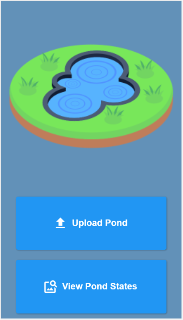
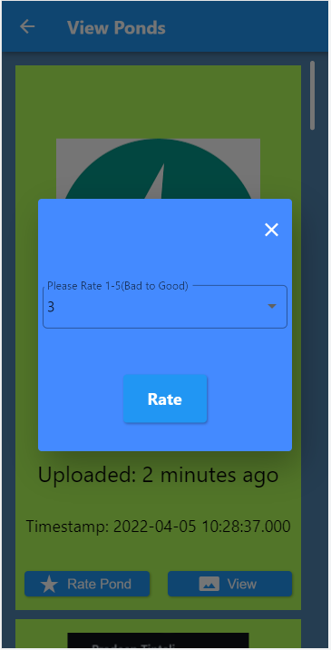

# Algorithm Problem
Implemented in the algorithm.py file, with Python3.9
- To run scrpit
```bash
# To get application dependecies
$ python algorithm.py
```

# Image Capture Problem
## Backend
Implemented backend with python Flask as specified in the requirements with a MySQL database.
Majority of the problems logic is implemeted in the backend folder.
Source code located in the backend folder with a README file for running the application.
## Frontend
Implemented frontend with Flutter, application works for web and mobile(Tested on android, likely to work for iOS too).
Application has three pages:
### Landing Page

Functionality:
- User can select an image to upload
- User can view image uploads

### Upload Page

Functionality:
- User can view uploaded image
- User must select decsription of image to be uplaoded
- User can post upload
    
### View Uploads Page

Functionality:
- User can view uploaded images with timestamp, description and rating(if available)
- User can rate an unrated upload
- User can view upload in dialog


<p float="left">
  
   
  
  
   
</p>


